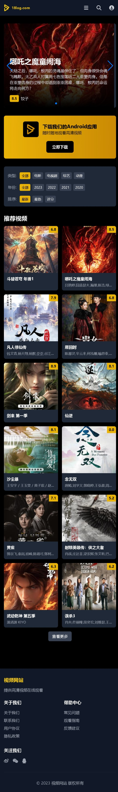

<div align="center">
  <a href="https://www.augmentcode.com/">
    
  </a>
  <h1>视频网站 Web 前端</h1>
  <p><b>由 <a href="https://www.augmentcode.com/">Augment AI</a> 独立开发完成</b></p>
</div>

这是一个基于Spring Boot的视频网站Web前端项目，采用前后端分离架构，但保留服务器端渲染的SEO优势。项目使用Kotlin语言开发，通过API代理模式与后端服务交互，并使用Thymeleaf模板引擎渲染页面。

## 项目截图

<div align="center">
  <h3>Web版首页</h3>
  

  <h3>移动版首页</h3>
  
</div>

## 项目协作

本项目是由Augment AI与darcychuchu共同协作完成的开源项目。Augment AI负责所有代码的开发与实现，darcychuchu负责测试与问题反馈。项目代码已托管在GitHub上，由Augment AI持续维护。如发现任何问题，请通过GitHub Issues提交，我们将及时处理。

## 项目特点

- **SEO友好**：关键数据直接嵌入HTML源代码，提高搜索引擎索引效果
- **缓存优化**：使用Redis缓存API响应，支持Redis故障时自动切换到内存缓存
- **响应式设计**：适配各种屏幕尺寸，提供良好的移动端体验
- **对话框式UI**：使用对话框显示选集列表，避免长页面滚动
- **API代理**：统一处理所有API请求，简化前端代码
- **健康检查**：定期检查API服务器健康状态，提高系统可靠性
- **用户认证**：支持用户注册、登录和个人资料管理

## 技术栈

- **后端**：Spring Boot 3.4.4 + Kotlin 1.9.25
- **模板引擎**：Thymeleaf
- **缓存**：Spring Cache + Redis
- **HTTP客户端**：RestTemplate + Apache HttpClient
- **前端**：Tailwind CSS + JavaScript

## 项目架构

本项目采用以下架构：

1. **API服务器**：提供JSON API，包含数据库和业务逻辑
2. **Web服务器**（本项目）：不连接数据库，只负责渲染页面
   - 从API服务器获取数据
   - 使用Thymeleaf渲染HTML
   - 将不常变动的数据直接嵌入HTML
   - 只保留经常变动的数据与API交互

## 项目结构

```
src/main/
├── kotlin/com/vlog/web/
│   ├── VideoWebApplication.kt        # 主应用类
│   ├── config/                       # 配置类
│   │   ├── CacheConfig.kt            # 缓存配置
│   │   └── RestTemplateConfig.kt     # RestTemplate配置
│   ├── controller/                   # 控制器
│   │   ├── ApiProxyController.kt     # API代理控制器
│   │   ├── GlobalExceptionHandler.kt # 全局异常处理
│   │   ├── HomeController.kt         # 首页控制器
│   │   ├── UserController.kt         # 用户控制器
│   │   ├── CaptchaController.kt      # 验证码控制器
│   │   └── VideoController.kt        # 视频详情控制器
│   ├── dto/                          # 数据传输对象
│   │   ├── AddressDto.kt             # 地址DTO
│   │   ├── ApiResponse.kt            # API响应DTO
│   │   ├── CategoriesDto.kt          # 分类DTO
│   │   ├── UsersDto.kt               # 用户DTO
│   │   └── ...                       # 其他DTO
│   ├── entity/                       # 实体类
│   │   └── Users.kt                  # 用户实体
│   └── service/                      # 服务类
│       ├── ApiHealthChecker.kt       # API健康检查服务
│       ├── ApiProxyService.kt        # API代理服务
│       ├── ApiService.kt             # API服务
│       ├── CaptchaService.kt         # 验证码服务
│       └── UserService.kt            # 用户服务
└── resources/
    ├── application.yml               # 应用配置
    ├── static/                       # 静态资源
    │   ├── css/                      # CSS文件
    │   └── images/                   # 图片文件
    └── templates/                    # Thymeleaf模板
        ├── detail.html               # 视频详情页
        ├── error.html                # 错误页
        ├── index.html                # 首页
        ├── layout.html               # 布局模板
        ├── list.html                 # 列表页
        └── user/                     # 用户相关页面
            ├── login.html            # 登录页
            ├── register.html         # 注册页
            └── profile.html          # 个人资料页
```

## 快速开始

### 前提条件

- JDK 17+
- Gradle 8.0+

### 配置

在 `application.yml` 中配置：

```yaml
server:
  port: 8091  # 应用服务器端口
  servlet:
    context-path: /  # 应用上下文路径

spring:
  thymeleaf:
    cache: false  # 开发环境禁用缓存
    mode: HTML
    encoding: UTF-8

api:
  base-url: https://66log.com/api/json/v1  # API服务器地址
  image-url: http://127.0.0.1:8082  # 图片服务器地址（如需要）
```

### 构建和运行

```bash
# 克隆项目
git clone https://github.com/darcychuchu/VlogWeb.git
cd VlogWeb

# 构建项目
./gradlew build

# 运行项目
./gradlew bootRun
```

或者使用IDE（如IntelliJ IDEA）直接运行 `org.vlog.web.VlogWebApplication.kt`。

### 访问

应用启动后，访问 http://localhost:8091

## 功能说明

### 视频浏览

- **首页**：展示推荐视频
- **列表页**：支持按类型、地区、年份等筛选视频
- **详情页**：显示视频详情、播放器、选集列表和相关推荐

### 用户功能

- **注册**：支持用户名和昵称唯一性验证，内置验证码防止恶意注册
- **登录**：用户登录并保存会话
- **个人资料**：查看和更新个人资料，包括昵称和头像（昵称只能修改一次）

### 性能优化

- **直接API调用**：直接调用API服务，无缓存中间层，避免服务器负载问题
- **异步处理**：使用Spring的异步处理能力处理请求
- **资源压缩**：启用了图片资源的压缩传输

## API文档

本项目通过API代理与后端服务交互，主要包括以下API：

- **视频API**：获取视频列表、详情、播放信息等
- **用户API**：用户注册、登录、资料更新等

详细API文档请参考：
- [视频API文档](docs/VIDEO-API.md)
- [用户API文档](docs/USER-API.md)

## 开发指南

### 添加新功能

1. **阅读文档**：确保了解项目架构和设计理念
2. **遵循模式**：新功能应遵循现有的代码模式和架构
3. **测试**：添加功能后进行充分测试

### 测试

1. **编译测试**：确保代码能够成功编译
2. **功能测试**：确保Web页面访问时返回200状态码
3. **浏览器测试**：使用浏览器开发者工具检查网络请求和控制台错误

### 故障排除

如果遇到API连接问题，请检查以下几点：

1. 确认API服务器地址配置正确
2. 检查网络连接是否正常
3. 查看应用日志中是否有详细错误信息

## 贡献

欢迎贡献代码！请遵循以下步骤：

1. Fork 项目
2. 创建功能分支 (`git checkout -b feature/amazing-feature`)
3. 提交更改 (`git commit -m 'Add some amazing feature'`)
4. 推送到分支 (`git push origin feature/amazing-feature`)
5. 创建Pull Request

## 许可证

MIT
